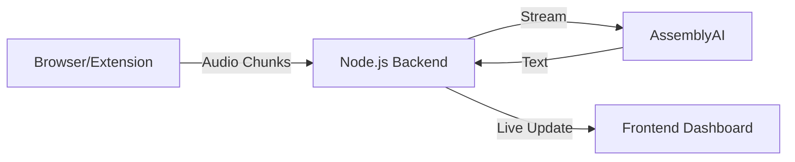
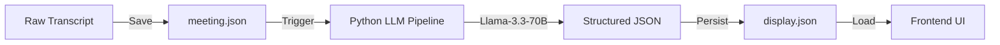
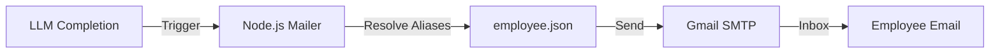

# AI Meeting Intelligence System

a real-time meeting assistant that transforms raw audio into actionable intelligence. By capturing both microphone and system audio, the platform uses advanced AI models to provide live transcription, automated meeting summaries, and intelligent task assignments with email notifications.

---

## 🚀 Key Features

- **Multimodal Audio Capture**: Simultaneously records microphone input and browser tab audio.
- **Live Transcription**: Real-time speech-to-text powered by AssemblyAI.
- **AI Intelligence**: Automated generation of brief/detailed summaries, meeting topics, and key notes using Llama-3.3-70B.
- **Smart Task Management**: Automatically identifies tasks, assignees, and deadlines from transcripts.
- **Role-Based Dashboards**:
  - **Employee View**: Personal workspace with specific tasks and deadlines.
  - **Manager Oversight**: Team-wide task tracking and performance analytics.
- **Automated Notifications**: Sends professional email alerts via Gmail SMTP when new tasks are assigned.
- **Secure Access**: Simple credentials-based login with role-based access control.

---

## 🛠 Tech Stack

### Frontend

- **HTML5 & Vanilla CSS**: Premium glassmorphism-based design with custom animations and a professional White-Black-Gold theme.
- **JavaScript (ES Modules)**: Modular architecture for streaming pipelines and UI management.
- **Socket.io-client**: Real-time communication with the backend.

### Backend

- **Node.js & Express**: High-performance API server.
- **Socket.io**: WebSockets for low-latency audio streaming and transcript updates.
- **FileSystem (JSON Storage)**: Persistent storage using structured JSON files (`meeting.json`, `display.json`, `employee.json`).

### AI & Services

- **AssemblyAI**: State-of-the-art Speech-to-Text (STT) API.
- **Llama-3.3-70B-Instruct**: LLM hosted on Hugging Face Inference API for structured data extraction.
- **Nodemailer**: Automated notification service via Gmail SMTP.
- **Python (llm.py)**: Dedicated script for interfacing with the Hugging Face hub.

---

## 📊 Core Pipelines

### 1. Capture & Transcription Pipeline



### 2. Intelligence & Summary Pipeline



### 3. Notification Pipeline



---

## 🔄 Project Workflow

1. **Authentication**: Users log in via the Login page. Employees see personal tasks; Managers gain access to the Oversight Panel.
2. **Meeting Session**: The "Start Meeting Assistant" initiates the dual-audio capture. Live transcripts appear as the meeting progresses.
3. **Data Generation**: When the session stops, the raw data is persisted. The backend automatically triggers the Python/Llama pipeline.
4. **Insight Extraction**: The LLM parses the transcript to extract summaries, topics, and specific tasks (matching them to people in `employee.json`).
5. **Actionable Output**: `display.json` is updated. At the same time, `mailer.js` sends notification emails to anyone assigned a new task.
6. **Task Completion**: Users can mark tasks as "Done" on their dashboard, which persists the change back to the backend.

---

## ⚙️ Installation & Setup

1. **Clone the repository**:

   ```bash
   git clone <repo-url>
   ```

2. **Backend Setup**:
   - Navigate to `/backend`
   - Install dependencies: `npm install`
   - Install Python dependencies: `pip install huggingface_hub python-dotenv`
   - Create a `.env` file (see `.env.example` for required keys).

3. **Running the App**:
   - Start the backend: `npm start`
   - Open `frontend/login.html` in your browser.

---

## 📁 Repository Structure

- `/frontend`: HTML pages, CSS styles, and client-side JS pipelines.
- `/backend`: Express routes, services, and the Python LLM logic.
- `/backend/data`: JSON storage for meetings and employee records.
- `/backend/logs`: System and pipeline logs.
